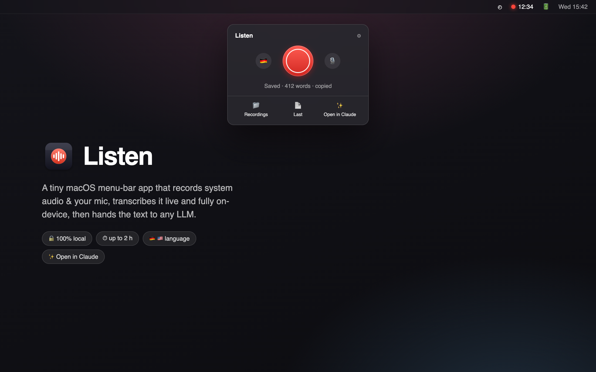

<p align="center">
  
</p>

<h1 align="center">Listen</h1>

<p align="center">
  A tiny macOS menu-bar app that records <b>system audio</b> &amp; your <b>mic</b>,
  transcribes it live and <b>fully on-device</b>, then hands the text to any LLM.<br>
  No cloud, no accounts, no virtual audio drivers — one Swift file + a 5&nbsp;MB CLI.
</p>

<p align="center">
  🔒 100% local &nbsp;·&nbsp; ⏱ up to 2&nbsp;hours &nbsp;·&nbsp; 🇩🇪 🇺🇸 language toggle &nbsp;·&nbsp; ✨ Open in Claude
</p>

---

## What it does

- **One red button** in the menu bar starts/stops recording. The bar shows a live `● 12:34` timer.
- **Records the call, both sides** — system audio (the other person, the video, the meeting) *and* your microphone, with speaker labels `Me:` / `Them:`.
- **Transcribes live and on-device** using Apple's SpeechAnalyzer (via [`yap`](https://github.com/finnvoor/yap)) — nothing leaves your Mac.
- **Language toggle** right next to the record button — 🇩🇪 German / 🇺🇸 English (one language per session).
- **Saves a clean transcript** to your folder of choice (default `~/Downloads`) as Markdown, plain text, or `.srt` subtitles — and copies it to the clipboard on stop.
- **Open in Claude** — copies the transcript and opens the Claude desktop app; press `⌘V` and go. Or pipe the file into any LLM you like.
- Survives crashes (auto-restarts and appends) and auto-stops at the 2-hour mark.

## How it works

```
yap listen[-and-dictate]  →  Listen parses the stream  →  ~/Downloads/call-*.md
(Core Audio tap + Apple        (speaker labels, 2 h cap,        ↓
 SpeechAnalyzer, on-device)     crash auto-restart)         Open in Claude / clipboard / any LLM
```

## Get it

**Requirements:** macOS 26 (Tahoe) or later — that's when Apple shipped the on-device transcription engine.

```sh
# 1. Install the transcription engine
brew install yap

# 2. Clone and build (compiles, installs to ~/Applications, launches)
git clone https://github.com/emilmeggle/Listen.git
cd Listen
./build.sh
open ~/Applications/Listen.app
```

On first record, macOS asks for **Screen &amp; System Audio Recording** (and **Microphone** if the mic is on). Grant them, then — because macOS only applies the permission to a freshly started app — click **Relaunch Listen** in the dialog and record again. Once granted, it sticks.

> **Tip — stable permissions across rebuilds.** Ad-hoc signed apps lose their grant on every rebuild. To avoid re-granting, create a self-signed code-signing certificate named **`Listen Dev`**, trust it for code signing in Keychain Access, and `build.sh` will use it automatically.

To launch at login: System Settings → General → Login Items → add Listen.

## Usage

| Control | What it does |
|---|---|
| 🔴 Record button | Start / stop. Turns into a stop square; menu bar shows the timer. |
| 🇩🇪 / 🇺🇸 flag | Switch transcription language (before recording). |
| 🎙 mic | Toggle microphone — on for calls, off for videos/podcasts. |
| ⚙ gear | Save location, file format (`.md` / `.txt` / `.srt`), quit. |
| 📁 Recordings · 📄 Last · ✨ Open in Claude | Open the folder, the latest transcript, or send it to Claude. |

## Credits

- [**yap**](https://github.com/finnvoor/yap) by Finn Voorhees (CC0) — the on-device transcription engine this wraps.
- [**AudioCap**](https://github.com/insidegui/AudioCap) by Guilherme Rambo (BSD-2) — reference for Core Audio process taps.

## License

MIT — see [LICENSE](LICENSE).
